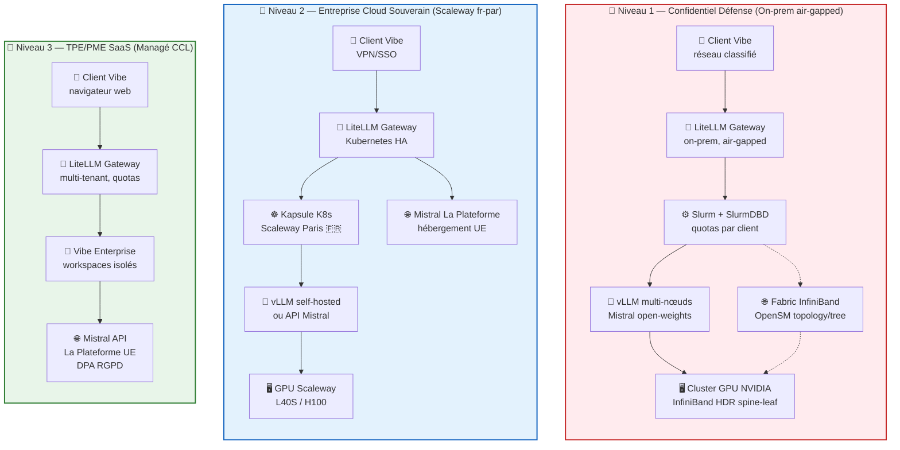

# 🏛️ Schéma global — Architecture IA Souveraine 3 Niveaux

```mermaid
flowchart TB
    subgraph N1["🥇 Niveau 1 — Confidentiel Défense (On-prem air-gapped)"]
        direction TB
        C1["👤 Client Vibe<br/>réseau classifié"] --> GW1["🔀 LiteLLM Gateway<br/>on-prem, air-gapped"]
        GW1 --> SLURM["⚙️ Slurm + SlurmDBD<br/>quotas par client"]
        SLURM --> VLLM1["🧠 vLLM multi-nœuds<br/>Mistral open-weights"]
        VLLM1 --> GPU1["🖥️ Cluster GPU NVIDIA<br/>InfiniBand HDR spine-leaf"]
        SLURM -.-> IB["🌐 Fabric InfiniBand<br/>OpenSM topology/tree"]
        IB -.-> GPU1
    end

    subgraph N2["🥈 Niveau 2 — Entreprise Cloud Souverain (Scaleway fr-par)"]
        direction TB
        C2["👤 Client Vibe<br/>VPN/SSO"] --> GW2["🔀 LiteLLM Gateway<br/>Kubernetes HA"]
        GW2 --> K8S["☸️ Kapsule K8s<br/>Scaleway Paris 🇫🇷"]
        K8S --> VLLM2["🧠 vLLM self-hosted<br/>ou API Mistral"]
        VLLM2 --> GPU2["🖥️ GPU Scaleway<br/>L40S / H100"]
        GW2 --> API2["🌐 Mistral La Plateforme<br/>hébergement UE"]
    end

    subgraph N3["🥉 Niveau 3 — TPE/PME SaaS (Managé CCL)"]
        direction TB
        C3["👤 Client Vibe<br/>navigateur web"] --> GW3["🔀 LiteLLM Gateway<br/>multi-tenant, quotas"]
        GW3 --> VIBE3["🤖 Vibe Enterprise<br/>workspaces isolés"]
        VIBE3 --> API3["🌐 Mistral API<br/>La Plateforme UE<br/>DPA RGPD"]
    end

    style N1 fill:#ffebee,stroke:#c62828,stroke-width:2px
    style N2 fill:#e3f2fd,stroke:#1565c0,stroke-width:2px
    style N3 fill:#e8f5e9,stroke:#2e7d32,stroke-width:2px
```
