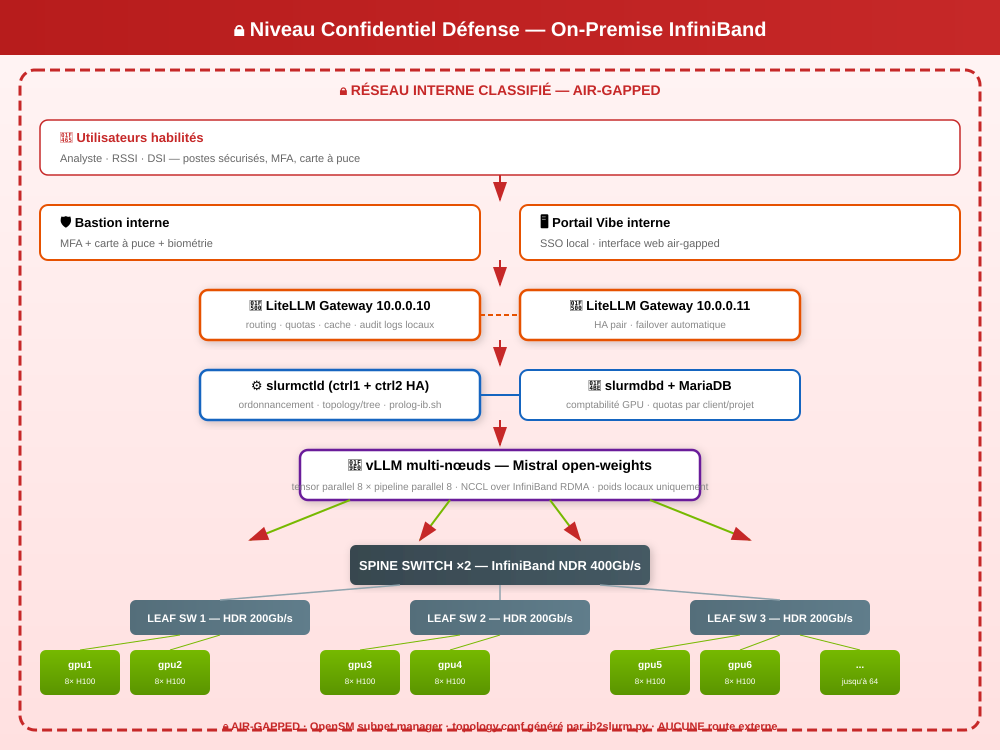
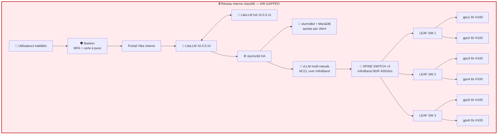

# 🔒 Schéma détaillé — Niveau Confidentiel Défense (On-premise InfiniBand)

  

---

## Version Mermaid (éditable)

```mermaid
flowchart TB
    subgraph RESEAU["🔒 Réseau interne classifié — AIR-GAPPED"]
        U["👥 Utilisateurs habilités"] --> BASTION["🛡️ Bastion<br/>MFA + carte à puce"]
        BASTION --> PORTAIL["Portail Vibe interne"]
        PORTAIL --> LLM1["🔀 LiteLLM 10.0.0.10"]
        LLM1 <--> LLM2["🔀 LiteLLM HA 10.0.0.11"]
        LLM1 --> SCTLD["⚙️ slurmctld HA"]
        SCTLD --> DB["💾 slurmdbd + MariaDB<br/>quotas par client"]
        SCTLD --> VLLM["🧠 vLLM multi-nœuds<br/>NCCL over InfiniBand"]
        VLLM --> SPINE["🔀 SPINE SWITCH ×2<br/>InfiniBand NDR 400Gb/s"]
        SPINE --> LEAF1["LEAF SW 1"]
        SPINE --> LEAF2["LEAF SW 2"]
        SPINE --> LEAF3["LEAF SW 3"]
        LEAF1 --> GPU1["gpu1 8x H100"]
        LEAF1 --> GPU2["gpu2 8x H100"]
        LEAF2 --> GPU3["gpu3 8x H100"]
        LEAF2 --> GPU4["gpu4 8x H100"]
        LEAF3 --> GPU5["gpu5 8x H100"]
        LEAF3 --> GPU6["gpu6 8x H100"]
    end
    style RESEAU fill:#ffebee,stroke:#c62828,stroke-width:3px
```
