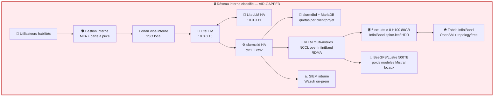

# 🔒 Schéma — Niveau Confidentiel Défense (On-premise air-gapped)

```mermaid
flowchart TB
    subgraph RESEAU["🔒 Réseau interne classifié — AIR-GAPPED"]
        U["👥 Utilisateurs habilités"] --> BASTION["🛡️ Bastion interne<br/>MFA + carte à puce"]
        BASTION --> PORTAIL["Portail Vibe interne<br/>SSO local"]
        PORTAIL --> LLM1["🔀 LiteLLM<br/>10.0.0.10"]
        LLM1 <--> LLM2["🔀 LiteLLM HA<br/>10.0.0.11"]
        LLM1 --> SCTLD["⚙️ slurmctld HA<br/>ctrl1 + ctrl2"]
        SCTLD --> DB["💾 slurmdbd + MariaDB<br/>quotas par client/projet"]
        SCTLD --> VLLM["🧠 vLLM multi-nœuds<br/>NCCL over InfiniBand RDMA"]
        VLLM --> GPU["🖥️ 6 nœuds × 8 H100 80GB<br/>InfiniBand spine-leaf HDR"]
        GPU <--> IB["🌐 Fabric InfiniBand<br/>OpenSM + topology/tree"]
        VLLM --> STOCK["💾 BeeGFS/Lustre 500TB<br/>poids modèles Mistral locaux"]
        SCTLD --> SIEM["📊 SIEM interne<br/>Wazuh on-prem"]
    end
    style RESEAU fill:#ffebee,stroke:#c62828,stroke-width:3px
```
