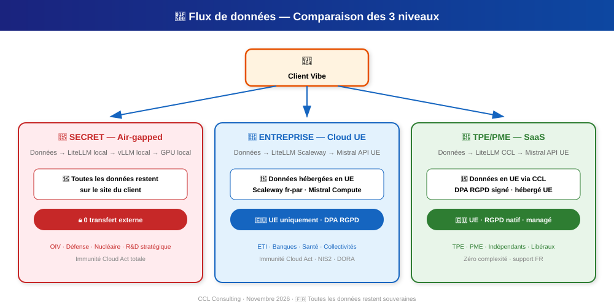
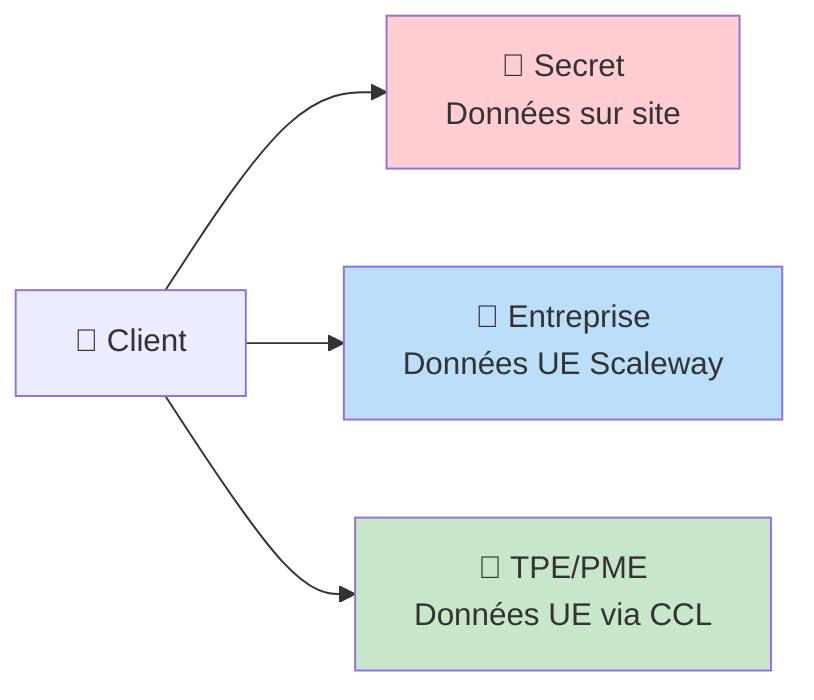

# 🔀 Schéma — Flux de données par niveau

  

---

## Version Mermaid (éditable)

```mermaid
flowchart LR
    CLIENT["👤 Client"] --> N1["🥇 Secret<br/>Données sur site"]
    CLIENT --> N2["🥈 Entreprise<br/>Données UE Scaleway"]
    CLIENT --> N3["🥉 TPE/PME<br/>Données UE via CCL"]
    style N1 fill:#ffcdd2
    style N2 fill:#bbdefb
    style N3 fill:#c8e6c9
```
