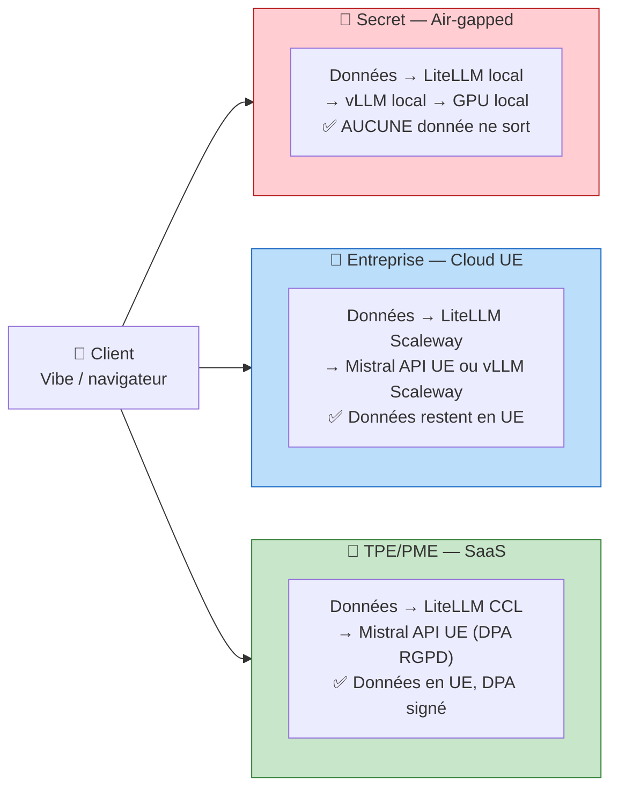

# 🔀 Schéma — Flux de données par niveau

```mermaid
flowchart LR
    CLIENT["👤 Client<br/>Vibe / navigateur"]
    
    subgraph N1["🥇 Secret — Air-gapped"]
        D1["Données → LiteLLM local<br/>→ vLLM local → GPU local<br/>✅ AUCUNE donnée ne sort"]
    end
    
    subgraph N2["🥈 Entreprise — Cloud UE"]
        D2["Données → LiteLLM Scaleway<br/>→ Mistral API UE ou vLLM Scaleway<br/>✅ Données restent en UE"]
    end
    
    subgraph N3["🥉 TPE/PME — SaaS"]
        D3["Données → LiteLLM CCL<br/>→ Mistral API UE (DPA RGPD)<br/>✅ Données en UE, DPA signé"]
    end
    
    CLIENT --> N1
    CLIENT --> N2
    CLIENT --> N3
    
    style N1 fill:#ffcdd2,stroke:#b71c1c
    style N2 fill:#bbdefb,stroke:#1565c0
    style N3 fill:#c8e6c9,stroke:#2e7d32
```
